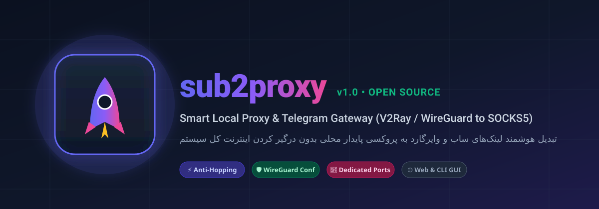
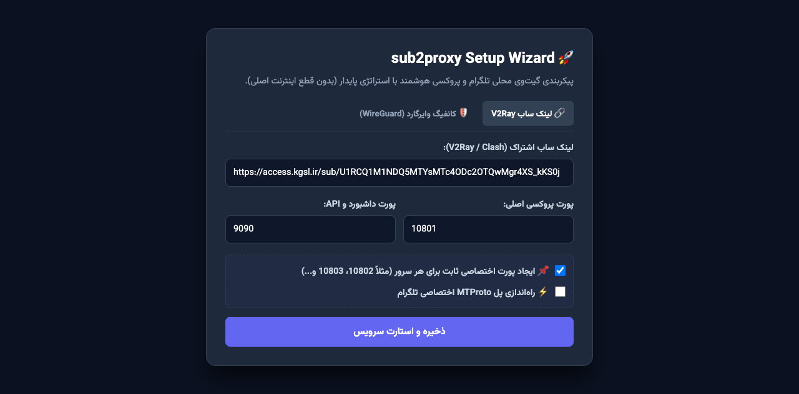
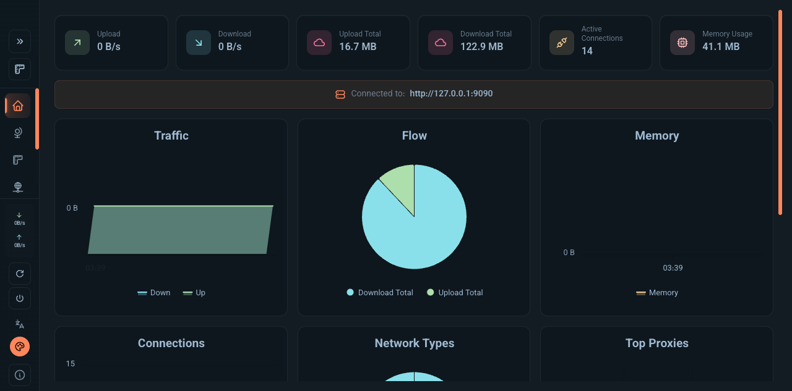

<p align="center">
  
</p>

<p align="center">
  <b>Smart Local Proxy & Telegram Gateway (V2Ray & WireGuard to SOCKS5/HTTP)</b><br>
  تبدیل آسان و هوشمند لینک‌های ساب V2Ray و کانفیگ‌های WireGuard به پروکسی محلی پایدار با تفکیک ترافیک
</p>

<p align="center">
  <a href="https://devsponsors.github.io"></a>
  <a href="https://devsponsors.github.io"></a>
  
  
</p>

---

## 📥 نصب و به‌روزرسانی سریع (دستورات مجزا)

### ۱. نصب اولیه (First-time Install):
کافیست در ترمینال macOS یا سرور لینوکس دستور زیر را اجرا کنید:
```bash
curl -fsSL https://raw.githubusercontent.com/ketabchi-ar/sub2proxy/main/install.sh | bash
```

### ۲. به‌روزرسانی یا تمدید ساب سوخته (Update / Renew):
اگر ساب شما منقضی شد یا سرورها تغییر کردند، فقط دستور به‌روزرسانی زیر را اجرا کنید:
```bash
curl -fsSL https://raw.githubusercontent.com/ketabchi-ar/sub2proxy/main/install.sh | bash -s -- --update
```
*(یا اگر مخزن را کلون کرده‌اید: `./install.sh --update`)*

---

## 🇮🇷 راهنمای فارسی

### 💡 پروژه sub2proxy چیست و چه دردی را دوا می‌کند؟
بسیاری از کاربران فنی، برنامه‌نویسان و تریدرها در ایران هنگام کار با فیلترشکن‌ها با مشکلات زیر دست‌وپنجه نرم می‌کنند:
1. **قفل شدن کل سیستم روی VPN:** اکثر کلاینت‌ها اینترنت کل سیستم را وارد تونل VPN می‌کنند؛ در نتیجه سایت‌های بانکی، شتاب، درگاه‌های پرداخت، اسنپ، بورس و سرورهای داخلی کند یا مسدود می‌شوند.
2. **پرش مداوم آی‌پی (IP Hopping) و حساسیت تلگرام:** کلاینت‌هایی که فقط بر اساس پینگ کار می‌کنند، هر چند دقیقه سرور را عوض می‌کنند؛ در نتیجه تلگرام مکرراً سشن عوض کرده و اکانت در معرض خطر لیمیت قرار می‌گیرد.
3. **هدررفت ترافیک حجمی:** تست‌های پینگ مکرر در پس‌زمینه حجم زیادی از ساب‌های حجمی مصرف می‌کنند.

**sub2proxy** تمام این مشکلات را حل می‌کند: یک پورت پروکسی محلی مستقل و پایدار ایجاد می‌کند، سریع‌ترین سرور سالم را انتخاب کرده و با استراتژی **Fallback و Lazy Check** بدون مصرف بی‌مورد حجم روی همان می‌ماند.

---

### 🌟 توضیح امکانات و دلیل اضافه شدن هر گزینه (چرا گذاشتیم؟)

| امکان / گزینه | چرا این گزینه را گذاشتیم؟ (مزیت فنی) |
| :--- | :--- |
| **۱. استراتژی اتصال پایدار و کاهش مصرف (Anti-Hopping & Lazy Check)** | برخلاف `url-test` که مدام سرور عوض می‌کند، روی **`fallback`** با قابلیت `lazy: true` تنظیم شده تا فقط هنگام قطعی سرور سوئیچ کند و در حالت بی‌کاری سیستم حتی ۱ مگابایت هم حجم هدر نرود. |
| **۲. عدم درگیر کردن کل سیستم (`tun: false`)** | کارت شبکه مجازی غیرفعال است؛ سایت‌های ایرانی و بانکی مستقیم باز می‌شوند و فقط تلگرام یا برنامه‌ای که پورت لوکال را بدهید از فیلترشکن عبور می‌کند. |
| **۳. پشتیبانی از کانفیگ وایرگارد (WireGuard)** | فایل‌های `.conf` وایرگارد را بدون نیاز به نصب کلاینت سنگین وایرگارد به یک پورت لوکال SOCKS5 تبدیل می‌کند. |
| **۴. پورت‌های اختصاصی ثابت به ازای هر سرور (Dedicated Ports)** | علاوه بر پورت هوشمند اصلی (`10801`)، برای هر تک‌سرور یک پورت ثابت جداگانه (مثل `10802` برای آلمان، `10803` برای هلند) ایجاد می‌شود. |
| **۵. تشخیص خودکار پورت آزاد (Auto Free Port)** | اگر پورت `9999` وب‌ویزارد مشغول باشد، اسکریپت خودکار اولین پورت آزاد بعدی را پیدا کرده و مرورگر را روی آن باز می‌کند. |
| **۶. سازگاری دوگانه مک و لینوکس (LaunchAgent / Systemd)** | پروکسی به شکل سرویس پایدار سیستمی ثبت می‌شود و با ری‌استارت شدن دستگاه، همیشه آماده به کار است. |

---

### 📸 تصاویر محیط نرم‌افزار

<p align="center">
  <b>ویزارد گرافیکی تحت وب (Web Setup Wizard)</b><br>
  
</p>

<p align="center">
  <b>پنل مانیتورینگ زنده سرورها (با فونت وزیرمتن)</b><br>
  
</p>

---

## 🇬🇧 English Documentation

### 💡 What is sub2proxy?
**sub2proxy** is a lightweight local proxy gateway built on top of the Mihomo core. It turns remote V2Ray subscriptions or raw WireGuard configs into stable local SOCKS5/HTTP proxies (`127.0.0.1:10801`) with zero system-wide network hijacking.

### 📥 Usage Commands
- **Fresh Install:**
  ```bash
  curl -fsSL https://raw.githubusercontent.com/ketabchi-ar/sub2proxy/main/install.sh | bash
  ```
- **Update / Renew Subscription:**
  ```bash
  curl -fsSL https://raw.githubusercontent.com/ketabchi-ar/sub2proxy/main/install.sh | bash -s -- --update
  ```

---

## 📜 License
Released under the [MIT License](LICENSE).
